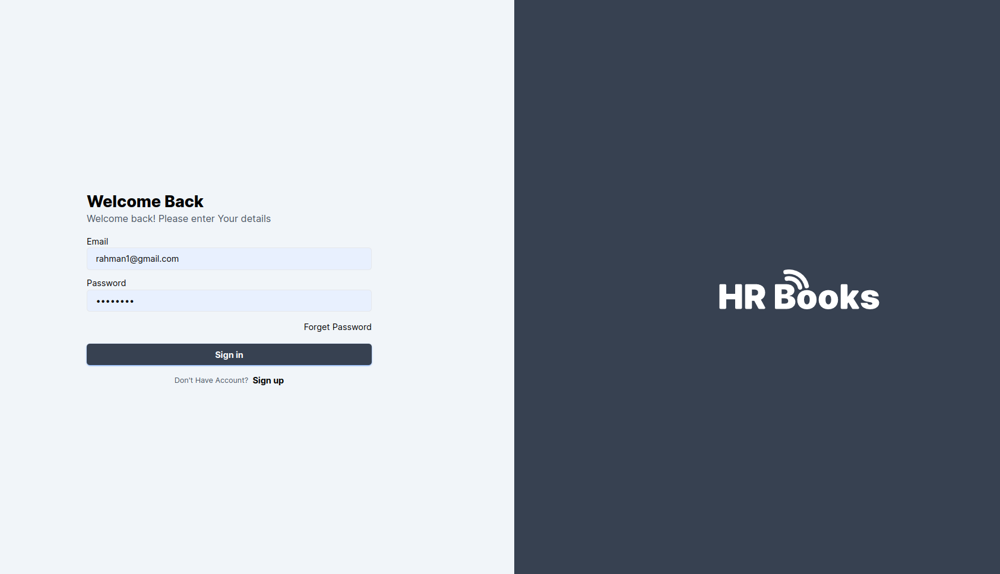
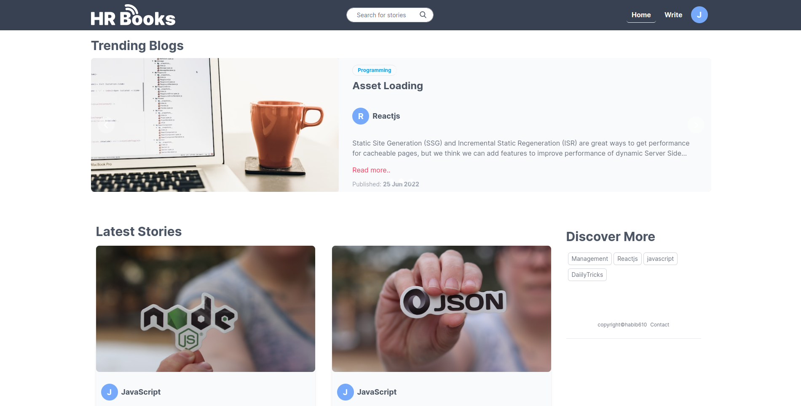
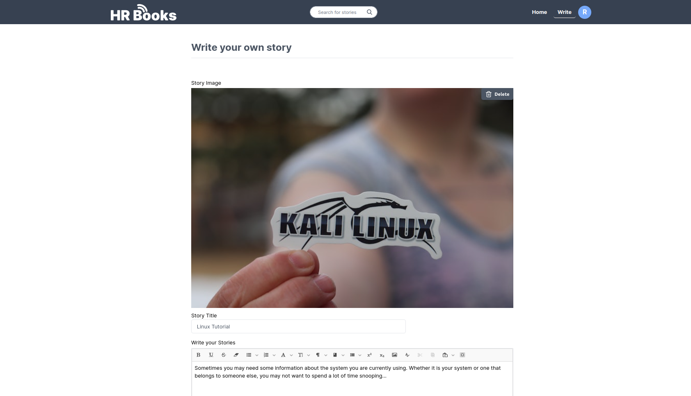
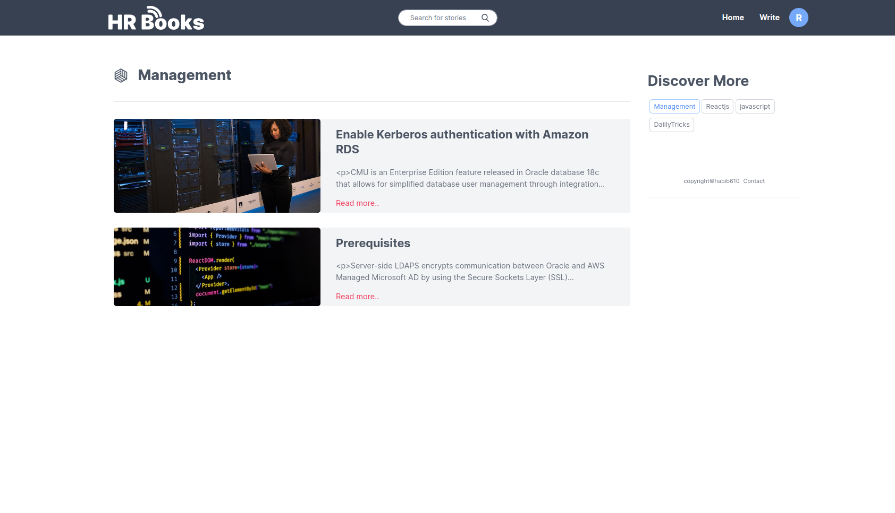
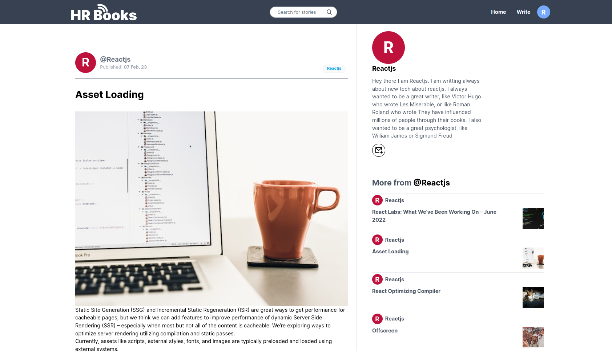
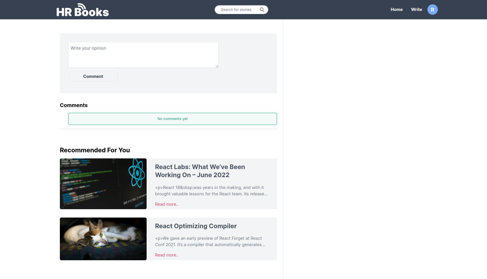
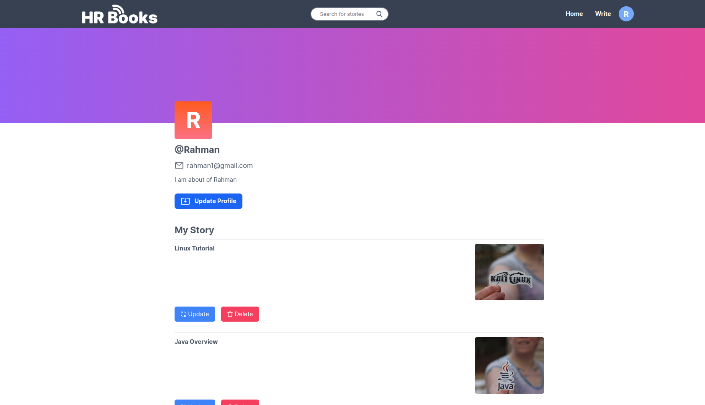
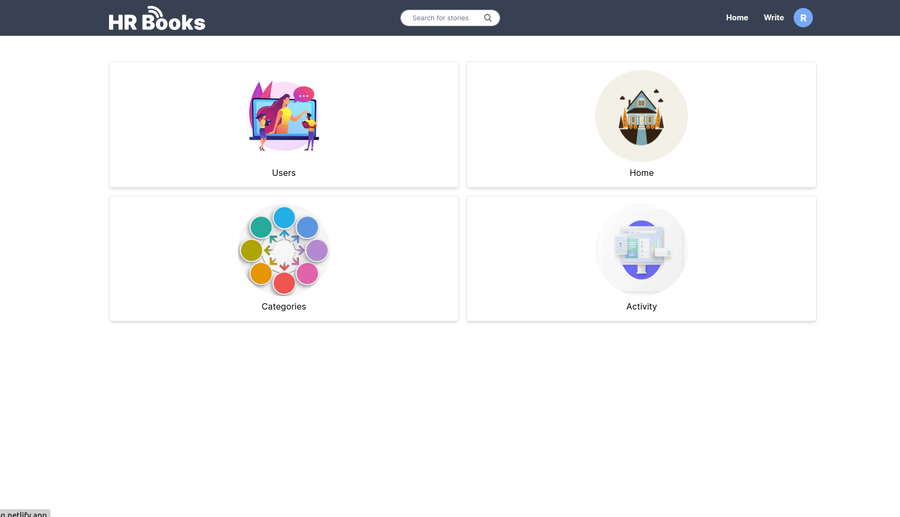
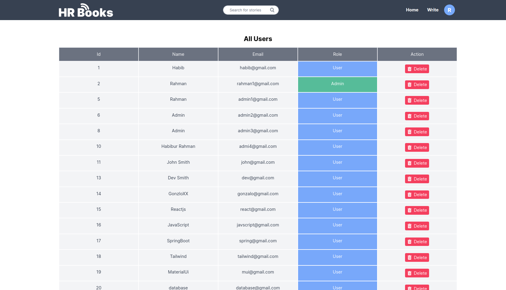
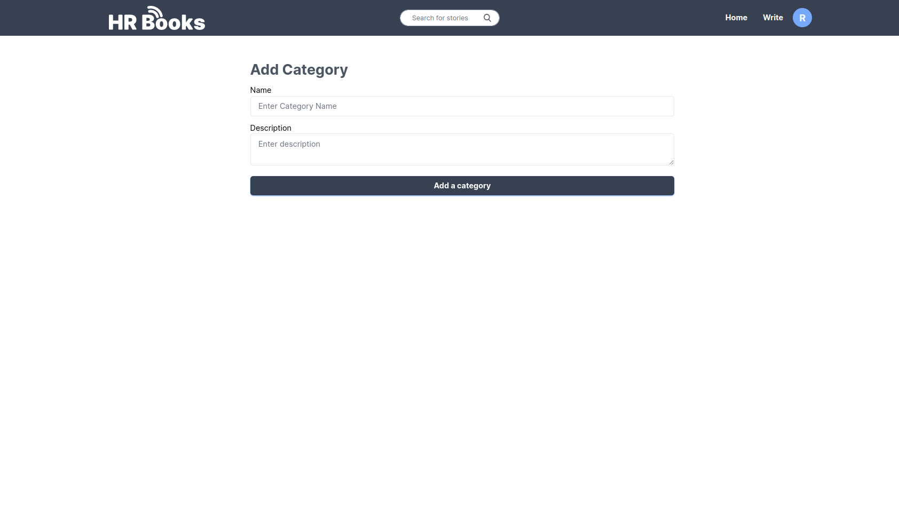

# Blog Sharing Platform made by Spring-Boot and React.js

---

# Overview

This application is a fullstack blog sharing platform where user can write their own post and read the others post. They can write their own comments on a specific post This application is created by Spring-Boot and React.js.

1. Login and Registration
2. Read and create story
3. Create comments on a post
4. Users profile with past posts
5. Update and delete existing post
6. Admin dashboard
7. Admin can delete users and create new categories

# Technologies Used

1.  Typescript
2.  JavaScript
3.  React.js
4.  Tailwindcss
5.  Framer Motion
6.  Java
7.  Spring-Boot
8.  PostgreSQL
9.  Maven
10. Spring Security
11. Amazon Web Service
12. Netlify

# Install packages and running the project:

1. ### `yarn install`
2. ### `yarn start`

Runs the app in the development mode.\
Open [http://localhost:3000](http://localhost:3000) to view it in the browser.

# Demo

## User Authentication && Authorization

## Trending Blogs and Latest Blogs

## Post your own story

## Searching and filtering

## Read story with relevant story

## Comment on any post and suggestions

## User profile, update and delete your post

## Admin Dashboard

## User List

## User List

## Post new category

---

# Live Preview

## [https://hrblog.netlify.app/](https://hrblog.netlify.app)
